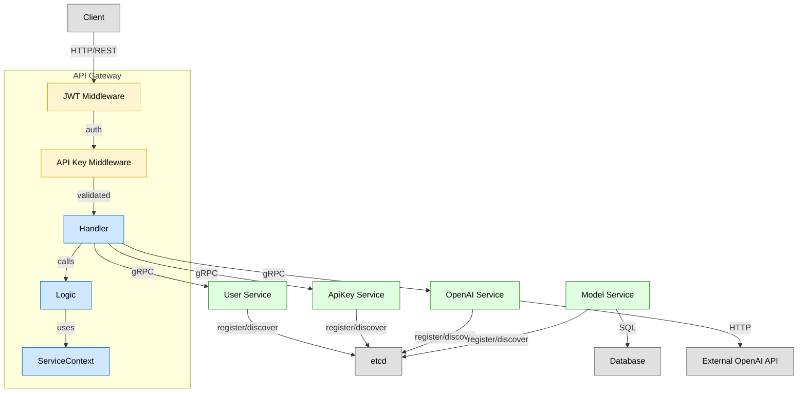

# API Router

一个基于 Go-Zero 框架开发的微服务 API 网关，提供用户认证、API 密钥管理和 OpenAI 代理服务。

## 📋 项目概述

API Router 是一个现代化的微服务架构项目，采用 Go-Zero 微服务框架构建，主要功能包括：

- 🔐 用户注册和登录认证系统
- 🗝️ API 密钥生成和管理
- 🤖 OpenAI API 代理服务
- 🛡️ JWT 身份验证和中间件
- 📊 基于 etcd 的服务发现

## ✅ 已实现功能

### 🔐 用户认证模块
- 用户注册功能
- 用户登录验证  
- JWT Token 生成和验证
- 安全的密码加密存储
- Token 过期自动刷新

### 🗝️ API 密钥管理
- 生成唯一 API 密钥
- API 密钥列表查询（支持分页）
- 获取单个密钥详情
- 删除 API 密钥
- 密钥状态管理（启用/禁用）
- 密钥权限控制

### 🤖 OpenAI 代理服务
- 完全兼容 OpenAI Chat API
- 支持流式和非流式响应
- 自动请求转发和响应处理
- API 密钥验证和鉴权

### 🛡️ 中间件和安全
- JWT 身份验证中间件
- API 密钥验证中间件
- 统一错误处理和响应格式
- 请求日志记录

## 🏗️ 系统架构



项目采用微服务架构，包含以下服务：

```
API Router
├── API Gateway (REST API)
├── User Service (gRPC)
├── ApiKey Service (gRPC)
├── OpenAI Service (gRPC)
└── Model Service (gRPC)
```

### 技术栈

- **框架**: [Go-Zero](https://go-zero.dev/) - 微服务框架
- **协议**: REST API + gRPC
- **认证**: JWT Token
- **服务发现**: etcd
- **构建工具**: Go Modules
- **协议缓冲**: Protocol Buffers

## ✨ 主要功能

### 🔐 用户认证模块
- 用户注册和登录
- JWT Token 生成和验证
- 安全的密码加密存储

### 🗝️ API 密钥管理
- 生成和管理 API 密钥
- 密钥权限控制
- 密钥状态管理（启用/禁用）

### 🤖 OpenAI 代理
- 完全兼容 OpenAI Chat API
- 支持流式和非流式响应
- 自动请求转发和响应处理

## 🛠️ 开发规范

### 后端规范

- **微服务架构**：采用 Go-Zero 框架进行微服务开发
- **gRPC 通信**：服务间通过 gRPC 进行高效通信
- **统一认证**：使用 JWT 进行身份验证和授权
- **安全存储**：密码使用 bcrypt 进行加密存储
- **服务发现**：基于 etcd 实现服务注册与发现
- **错误处理**：实现全局异常处理和统一返回格式
- **配置管理**：使用 YAML 格式进行配置管理
- **代码生成**：使用 goctl 工具自动生成代码骨架

### 项目结构

```
apirouter/
├── api/
│   ├── apirouter.api
│   ├── apirouter.go
│   ├── etc/
│   └── internal/
│       ├── config/
│       ├── handler/
│       ├── logic/
│       ├── middleware/
│       ├── svc/
│       └── types/
├── rpc/
│   ├── user/
│   │   ├── user.proto
│   │   ├── user.go
│   │   ├── etc/
│   │   └── internal/
│   ├── apikey/
│   ├── openai/
│   └── model/
├── go.mod
├── go.sum
├── LICENSE
└── README.md
```

--------------------------------

## 📄 许可证

本项目采用 MIT 许可证 - 查看 [LICENSE](LICENSE) 文件了解详情。

## 🙏 致谢

- [Go-Zero](https://go-zero.dev/) - 优秀的微服务框架
- [etcd](https://etcd.io/) - 可靠的分布式键值存储
- [gRPC](https://grpc.io/) - 高性能 RPC 框架

架构图由 *[ahmedkhaleel2004/gitdiagram](https://github.com/ahmedkhaleel2004/gitdiagram)* 生成